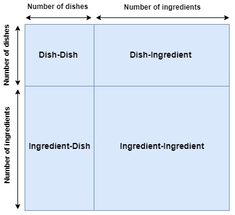
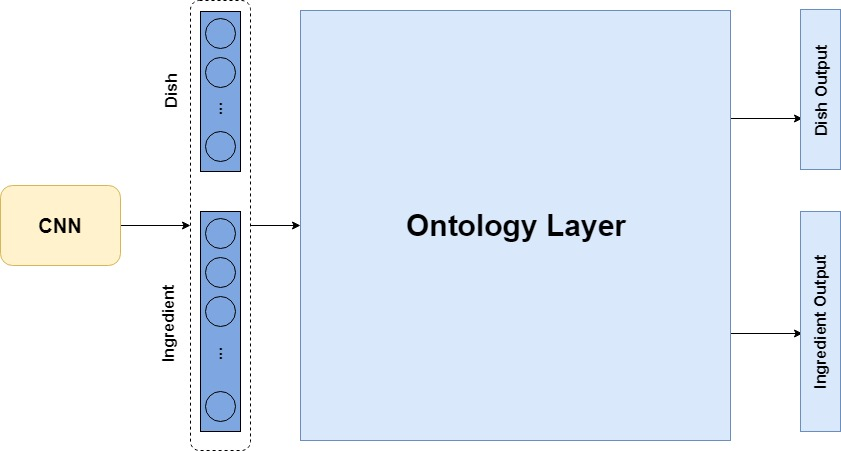
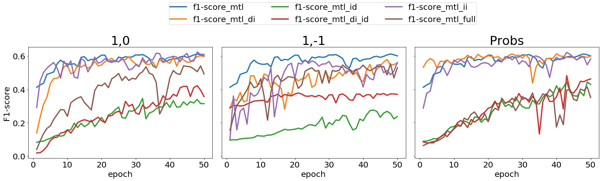
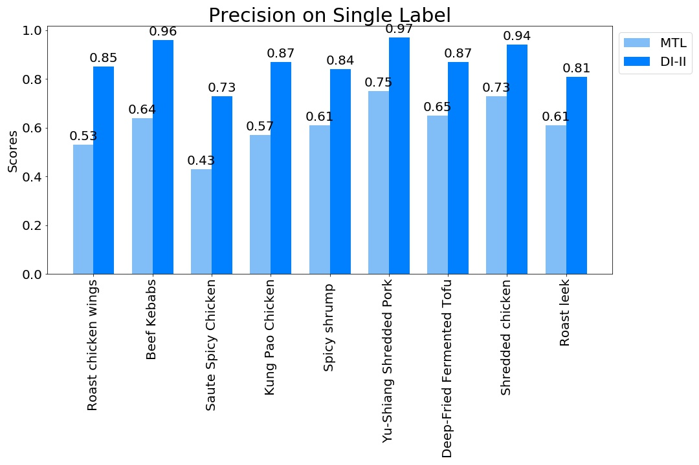
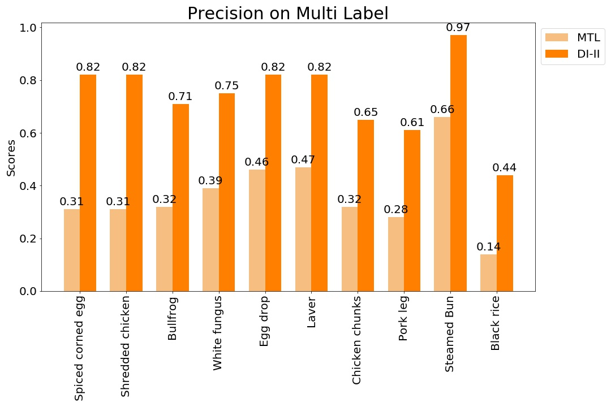

# Applying Deep Learning for Food Image Analysis

# Abstract

Food is an important component in people's daily life, examples of the
previous assertion are the range of possible diets according to the animal or
vegetal origin, the intolerance to some aliments and lately the increasing number
of food pictures in social networks. Several computer vision approaches have
been proposed for tackling food analysis problems, but few effort has been done
in taking benefit of the hierarchical relation between elements in a food image;
dish and ingredients.
In this project the highly performing state of the art CNN method is
adapted concatenating an ontology layer, a multidimensional layer which contains
the relation between the elements, in order to help during the classification
process. Different structures for the ontology have been tested to prove which
relations have the most beneficial impact, and which are less relevant. Additionally
to structure, the value of the elements that compound this hierarchical
relation layer play an important role, therefore the experiments performed contained
different weighted relations between the components. The ontology layer
is built with the labels of the multiple task in the dataset used to train the model.
At the end, the results obtained will be compared to a baseline model without
the ontology layer and it will be appreciated how hierarchical relations between
tasks benefits classification. Finally, the result will be a model which will be
able to simultaneously predict two food-related tasks; dish and ingredients.

# Hypothesis

This MSc project was begun with the idea that the relations between the elements in a food picture could help their own detection. From this hypothesis some questions aroused: Which relations would help more? How would be represented these relations? Which classes would obtain more benefit?...  

# Model Proposal

In order to represent these relations and include them in the model, a two dimensional layer was created, called the Ontology layer.
Different prototypes of this layer were tested, depending on the structure used and the element values used to represent the relation and non-relation between them.

# Architecture

The architecture of the model proposal consisted on using a pre-trained CNN with two additional dense layers(one per task), and finally concatenating the Ontology Layer to the top.

# Results

Below, it can be seen the performance of some structures and relational values combinations for the Recipes5k dataset.

Comparison of precision between baseline model (MTL) and our best model (DI-II) on VireoFood-172 dish labels 

Comparison of precision between baseline model (MTL) and our best model (DI-II) on VireoFood-172 ingredient labels

# Prepare environment

To be able to run the code in this repository it is required to create an environment with the following packages:

* tensorflow
* keras
* numpy
* pandas
* matplotlib
* scikit-learn
* multimodal-keras-wrapper

If the code is desired to be run on a GPU (install tensorflow-gpu), it is important to take care about the compatibility of the CUDA version with packages versions. In our case, it was CUDA 8.0, compatible with tensorflow-gpu == 1.4.0 and keras == 2.2, which force us to create a python 2.7 environment.

# Prepare Dataset

Download the [Recipes5k](http://www.ub.edu/cvub/recipes5k/) and [Vireo-Food 172](http://vireo.cs.cityu.edu.hk/VireoFood172/) datasets and locate them in dataset directory in their own respective folders. Each download file contains the whole image database, class labels files and train, validation and test split files. 

The notebook **Analyse image distribution.ipynb** does a proper statistical analysis of each of the datasets.

# Building Ontology
 
The  methodology to build the ontology is different for the two datasets.

For Recipes5k, the notebook **Recipes5k_prepare_data.ipynb** creates the files which contain the different relations, probabilities and concepts list. Once these files are generated, executing **Food_Analysis.py** file will generate the different Ontology files structures. At the end of the script **Food_Analysis.py** there are the execution parameters, _probabilities_ and _ontology_type_ define which type of relational value will conform the ontology generated.

It was the beginning of the project and we were playing around with the data, that´s why we used a notebook to do a tough task like this. 

For VireoFood-172, just run **make_ontology_matrix.py** and all the different structure value combinations will be built.

# Train models

To execute the models execute the script **main_train.py** passing a configuration file as an argument. Here is an example:

**_python -u main_train.py config_file=config_files/config_mtl_dish_ingr_ingr_dish_ont_prob_vireo_**

The confi_files directory contains all the configuration files used. The set the hyperparameters for each execution as well as the dataset used, ontology used and the target directories where to save the results.

# Results

The notebook **Comparison btw 5 versions of Ontologies.ipynb** reports the metric results (Accuracy and F1-score) for the first experiments with Recipes5k dataset.

**Display_results.ipynb** does the same for VireoFood-172 and all the different models tested. 

The results obtained in this notebook are included in the MSc report. Regarding the plots, the majority of them helped us to see how was improving our project, but some of them were also included in the report.

Script **predict.py** predicts the labels for all the images in Vireo test set. Executing it returns the predicted dish and ingredient files for the best models obtained. They will be stored in the results folder. The notebook **Precision_barplot.ipynb** computes the precision on each dish label and ingredient label for each model. The notebook includes a comparison plot between the MTL baseline and the best DI-II model. This plot compares the precision improvement in some dishes and ingredients. To conclude with the results part, in the notebook **Qualitative results.ipynb** there are some images predictions done by our best model and the baseline model.
